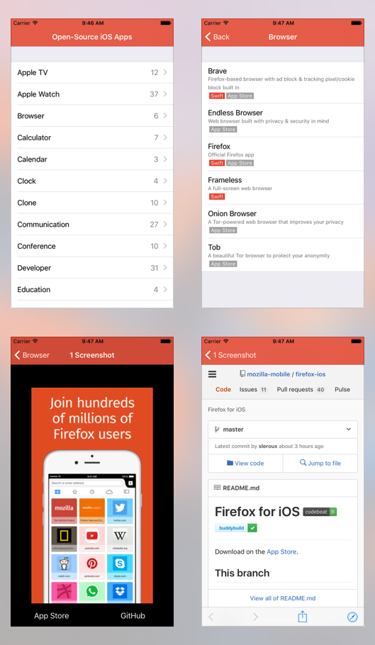

# osia

Super basic iOS app to browse [`open-source-ios-apps`](https://github.com/dkhamsing/open-source-ios-apps) :octocat:

## Getting Started

- `git clone https://github.com/dkhamsing/osia.git`
- `open osia/Xcode/OSIA.xcodeproj/`
- <kbd>CTRL</kbd> + <kbd>R</kbd>
- :sunglasses:

## Contact
- [github.com/dkhamsing](https://github.com/dkhamsing)
- [twitter.com/dkhamsing](https://twitter.com/dkhamsing)

## License

This project is available under the MIT license. See the [LICENSE](LICENSE) file for more info.
